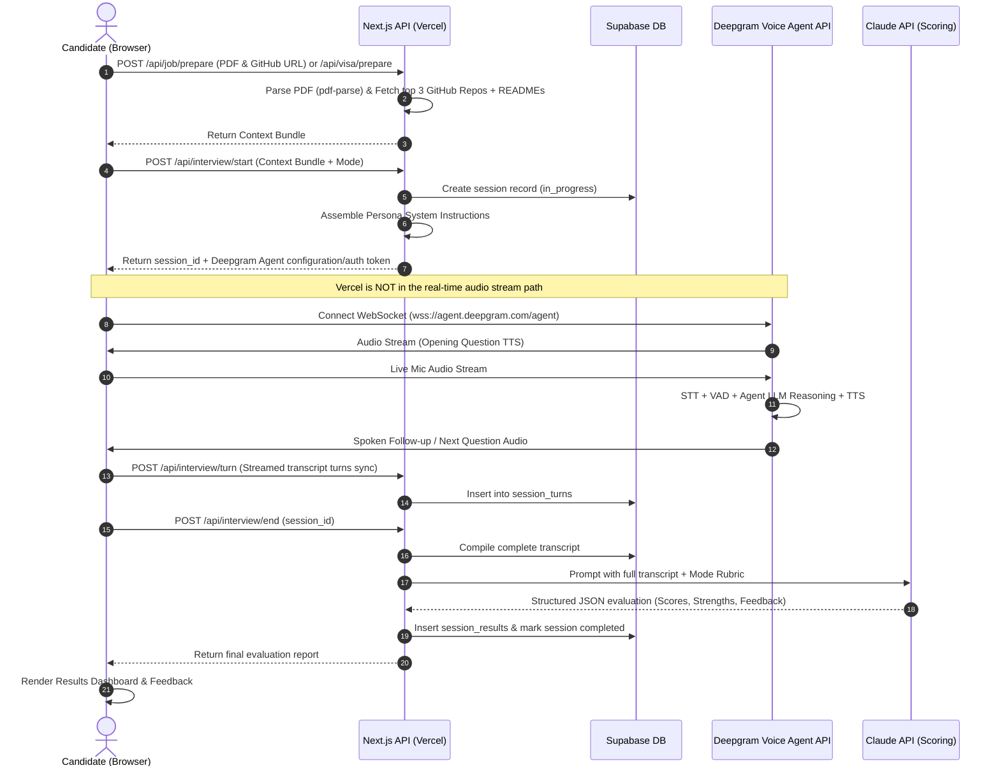

# Implementation Plan — AI Mock Interview Coach (Voice-Based)

Execution blueprint based on [PLAN.md](file:///e:/Ai/Interview_Coach/PLAN.md) to build an audio-only, real-time AI mock interview platform featuring **Job Interview Mode** (personalized via Resume PDF + GitHub repos) and **Visa Interview Mode** (personalized via Visa category & conversational consular probing), powered by **Next.js**, **Deepgram Voice Agent API**, **Supabase**, and **Claude API (Anthropic)**.

---

## Key Dependencies to Install

> [!NOTE]
> In addition to standard Next.js/Supabase/Anthropic SDKs, this plan relies on Deepgram's official **Browser Agent SDK** for the real-time voice connection (released May 2026) rather than a hand-rolled WebSocket client:
> - `@deepgram/agents` — framework-agnostic WebSocket client, mic capture, audio player, reconnection logic, built-in VAD
> - `@deepgram/react` — React provider + hooks wrapping the above
> - `@deepgram/ui` (optional) — pre-built conversation view, animated orb, waveform visualizer components
> - `pdf-parse` — resume text extraction
> - `@anthropic-ai/sdk` — Claude scoring calls
> - `@supabase/supabase-js` — DB client (browser + server variants)

---

## User Review Required

> [!IMPORTANT]
> **API Keys & Credentials Setup**:
> Building and running this application requires valid API keys in `.env.local`:
> - `DEEPGRAM_API_KEY` (Required for Voice Agent WebSocket session generation)
> - `ANTHROPIC_API_KEY` (Required for post-interview Claude scoring)
> - `NEXT_PUBLIC_SUPABASE_URL` & `NEXT_PUBLIC_SUPABASE_ANON_KEY` & `SUPABASE_SERVICE_ROLE_KEY`
> - `GITHUB_TOKEN` (Optional, prevents rate-limiting on public repo lookups)

> [!NOTE]
> **V1 Scope Confirmations** (from Section 16 of PLAN.md):
> 1. **Auth**: Anonymous sessions with UUID for v1 (Supabase Auth ready for later activation).
> 2. **Session Limit**: Recommended soft-cap of 15 minutes with a graceful warning at 13 minutes.
> 3. **Resume Retention**: In-memory PDF text extraction only; no raw PDF files stored in persistent storage.

---

## Architecture & Data Flow



---

## Phase-by-Phase Execution Roadmap

### Phase 1: Project Scaffolding & Design System
- Initialize Next.js (App Router, TypeScript, React 18/19).
- Set up project structure: `app/`, `components/`, `lib/`, `types/`, `styles/`.
- Build the **Design System** in `styles/globals.css` with a sleek, futuristic dark aesthetic:
  - Deep slate/obsidian palette (`#0B0F17`, `#111827`, glowing indigo/emerald accents).
  - Glassmorphic panels, subtle borders, glowing audio pulses.
  - Modern typography (Inter / Outfit).
  - Responsive layout for desktop and tablet screens.
- Configure environment schema and Supabase client bindings (`lib/supabase/client.ts`, `lib/supabase/server.ts`, `lib/supabase/admin.ts`).

### Phase 2: Database Schema & Supabase Configuration
- Define PostgreSQL migrations for the three core tables:
  1. `interview_sessions` (`id`, `mode`, `context_bundle`, `started_at`, `ended_at`, `status`).
  2. `session_turns` (`id`, `session_id`, `turn_index`, `speaker`, `question_text`, `answer_transcript`, `timestamp`).
  3. `session_results` (`id`, `session_id`, `overall_score`, `category_scores`, `strengths`, `weaknesses`, `per_question_feedback`, `flagged_concerns`, `created_at`).
- Set up indexes on `session_id` and Row Level Security (RLS) policies.

### Phase 3: Context Preparation Engines (Non-Realtime)
1. **Resume Parser (`lib/pdf.ts` & `/api/job/prepare`)**:
   - In-memory PDF text extraction using `pdf-parse`.
   - Sanitization and character-budget truncation (~3,000–4,000 chars) to prevent context window bloat.
2. **GitHub Fetcher (`lib/github.ts`)**:
   - Fetch top 3 most recently pushed public repositories via GitHub REST API:
     `GET https://api.github.com/users/{username}/repos?sort=pushed&direction=desc&per_page=3`.
   - For each repo, retrieve and base64-decode the `README.md`, summarizing/truncating to essential highlights.
   - Robust edge-case handling (user not found, 0 repos, missing READMEs).
3. **Visa Knowledge Base (`lib/visa-data.ts` & `/api/visa/prepare`)**:
   - Lookup matrix for visa categories (F1 Student, H1B Specialty Worker, B1/B2 Visitor, UK Student Route, Australia Subclass 500, etc.).
   - Tailored system prompt fragments instructing the AI consular officer persona on interrogation focus (ties to home country, financial evidence, program legitimacy, immigrant intent).
4. **Context Bundle Builder**:
   - Aggregates the inputs into the strict JSON schema defined in Section 6 of [PLAN.md](file:///e:/Ai/Interview_Coach/PLAN.md).

### Phase 4: Prompt Engineering & Deepgram Voice Agent Orchestrator
1. **System Prompt Synthesis**:
   - `lib/prompts/job-interviewer.ts`: Senior Technical / Hiring Manager persona tailored to the candidate's resume projects and GitHub tech stack.
   - `lib/prompts/visa-interviewer.ts`: Strict, professional Consular Officer persona probing for red flags conversationally.
2. **Deepgram Session Initialization (`/api/interview/start`)**:
   - Create session in Supabase.
   - Generate Deepgram Voice Agent configuration payload (STT: `nova-3`, LLM: `gpt-4o-mini` / `claude-3-5-haiku`, TTS: natural Aura voice, VAD configuration, and pre-seeded system prompt).
   - Mint a Deepgram **temporary token** server-side via `POST https://api.deepgram.com/v1/auth/grant` (using the real `DEEPGRAM_API_KEY`, never exposed to the client). This returns a short-lived JWT with a **30-second TTL by default** — only enough time to open the WebSocket handshake; once the connection is established it stays open for the full interview duration regardless of token expiry.
   - Return this temporary token (not the raw API key) to the browser, along with the session config.
   - **Recommendation:** expose this as a `/api/deepgram-token` endpoint following Deepgram's documented `tokenFactory` pattern (`tokenFactory: () => fetch('/api/deepgram-token').then(r => r.text())`), since Deepgram's own Browser Agent SDK (see Phase 5) calls this factory automatically before every connection and reconnection attempt — enabling automatic token rotation for free.

### Phase 5: Frontend Spoken Interview Room & Audio Streaming
1. **Direct Browser-to-Deepgram Connection via Deepgram's Browser Agent SDK**:
   - **Use Deepgram's official SDK packages instead of hand-rolling the WebSocket client.** Deepgram ships a layered Browser Agent SDK purpose-built for this exact use case:
     - `@deepgram/agents` — framework-agnostic core: WebSocket client, microphone capture, and audio player, with built-in reconnection logic, playback-aware mode tracking, audio buffering, optional Silero VAD, and KeepAlive pings.
     - `@deepgram/react` — React provider + hooks for connection state, conversation history, microphone control, audio playback, and client-side function calling (this is what `hooks/useDeepgramVoiceAgent.ts` should wrap, rather than implementing the WebSocket protocol from scratch).
     - `@deepgram/ui` (optional) — pre-built React components (conversation view, animated orb, mic/speaker controls, waveform visualizer) styled via CSS custom properties — could accelerate `AudioVisualizer.tsx` and `LiveTranscript.tsx`.
   - Initialize the connection using the `tokenFactory` pattern: `tokenFactory: () => fetch('/api/deepgram-token').then(r => r.text())` — the SDK calls this before every connection and reconnection attempt, so tokens stay short-lived and rotate automatically without custom logic.
   - Request microphone permissions (`navigator.mediaDevices.getUserMedia`) — handled by the SDK, but ensure the permission-denial UX (Phase 7) wraps it gracefully.
   - **Reconnection handling is provided by the SDK out of the box** — this removes the manual "WebSocket reconnection" work originally scoped under Phase 7's edge cases; Phase 7 should shift to *verifying* SDK reconnection behavior rather than building it.
2. **Interactive UI Components**:
   - **Mode Selection & Preparation Screen**: Tabbed view for Job vs. Visa, file dropzone for PDF, GitHub profile input with live status indicator, Visa dropdown, and strict gating validation.
   - **Live Interview Room (`app/interview/[id]/page.tsx`)**:
     - Real-time responsive Audio Visualizer (dynamic pulsing orb / waveform reacting to both user speech and AI voice).
     - Live turn transcript display with conversational feed.
     - Elapsed session timer and 15-minute time cap indicator.
     - Prominent "End Interview" control.
   - **Background Turn Sync**: Automatic POST to `/api/interview/turn` as turns finalize.

### Phase 6: Post-Interview Scoring & Feedback Report
1. **Claude Evaluation Pipeline (`lib/claude.ts` & `/api/interview/end`)**:
   - Compile turn history from `session_turns`.
   - Call the Claude API (use whichever current model string is recommended in Anthropic's docs at build time — do not hardcode an old model version) with mode-specific rubric:
     - **Job Rubric**: Relevance & depth, technical correctness vs GitHub claims, STAR structure, communication clarity, filler words.
     - **Visa Rubric**: Directness, internal consistency, lack of evasiveness, consular red flags (return intent, funding sufficiency).
   - Enforce structured JSON return schema matching Section 7 of [PLAN.md](file:///e:/Ai/Interview_Coach/PLAN.md).
2. **Results Dashboard UI (`app/results/[id]/page.tsx`)**:
   - Overall Score gauge (0–100) with rating badges (e.g. "Visa Ready", "Needs Polish").
   - Radar or categorized score breakdown.
   - Strengths and Weaknesses cards.
   - Per-question expandable review: Question asked, answer transcript summary, and AI coach recommendation.
   - Flagged concerns callouts (especially critical for Visa mode).

### Phase 7: Edge Cases, Resilience & Polish
- **Verify** (not build) network disconnect/reconnection behavior — `@deepgram/agents` handles reconnection logic internally; this phase confirms it recovers gracefully mid-interview and surfaces a UI status indicator during the reconnect window.
- Microphone permission denial guidance modal.
- GitHub rate limit handling (graceful fallback if unauthenticated rate limit reached).
- Session resumption / recovery safeguard if page is accidentally refreshed.
- Handle expired Deepgram temp-token edge case if the token endpoint is slow to respond (rare, given 30s TTL is only needed for the initial handshake).

---

## Proposed Project File Structure

```
e:/Ai/Interview_Coach/
├── PLAN.md                               # Project specification
├── package.json                          # Dependencies & scripts
├── tsconfig.json                         # TypeScript configuration
├── next.config.mjs                       # Next.js configuration
├── .env.example                          # Environment variable template
├── app/
│   ├── layout.tsx                        # Root layout with fonts & providers
│   ├── page.tsx                          # Mode selection & input landing page
│   ├── globals.css                       # Design system & theme styles
│   ├── interview/
│   │   └── [id]/
│   │       └── page.tsx                  # Live voice interview room
│   ├── results/
│   │   └── [id]/
│   │       └── page.tsx                  # Scored evaluation report page
│   └── api/
│       ├── job/prepare/route.ts          # Resume PDF parse + GitHub fetch
│       ├── visa/prepare/route.ts         # Visa context bundle preparation
│       ├── interview/
│       │   ├── start/route.ts            # Initialize session + Deepgram config
│       │   ├── turn/route.ts             # Log conversation turn
│       │   ├── end/route.ts              # Finalize & trigger Claude scoring
│       │   └── results/[id]/route.ts     # Fetch completed evaluation
│       └── deepgram-token/route.ts       # Mints short-lived (30s TTL) Deepgram token via
│                                          # POST /v1/auth/grant — called by the SDK's tokenFactory
├── components/
│   ├── interview/
│   │   ├── AudioVisualizer.tsx           # Canvas/CSS reactive audio wave
│   │   ├── LiveTranscript.tsx            # Real-time transcript feed
│   │   └── InterviewControls.tsx         # Mic mute, end interview, timer
│   ├── setup/
│   │   ├── JobSetupForm.tsx              # PDF upload + GitHub input
│   │   └── VisaSetupForm.tsx             # Visa category picker
│   └── results/
│       ├── ScoreOverview.tsx             # Overall score & category breakdown
│       ├── FeedbackCard.tsx              # Strengths, weaknesses, red flags
│       └── QuestionBreakdown.tsx         # Question-by-question critique
├── hooks/
│   └── useDeepgramVoiceAgent.ts          # Thin wrapper around @deepgram/react's connection hooks
                                           # (mic capture, playback, and WebSocket handling are
                                           # provided by the SDK — see Phase 5)
├── lib/
│   ├── claude.ts                         # Anthropic Claude scoring client
│   ├── deepgram.ts                       # Deepgram Voice Agent session factory
│   ├── github.ts                         # GitHub REST API client (repos + README)
│   ├── pdf.ts                            # PDF text parsing & truncation
│   ├── visa-data.ts                      # Visa categories & consular rubrics
│   ├── prompts/
│   │   ├── job-prompt.ts                 # System prompt for job interview
│   │   ├── visa-prompt.ts                # System prompt for visa consular
│   │   └── scoring-prompts.ts            # Prompts for Claude rubric evaluation
│   └── supabase/
│       ├── client.ts                     # Browser Supabase client
│       ├── server.ts                     # Server-side Supabase client
│       └── schema.sql                    # SQL schema migrations
└── types/
    ├── interview.ts                      # Session, Turn, ContextBundle types
    └── results.ts                        # Scoring & evaluation report types
```

---

## Verification Plan

### 1. Context Preparation Tests
- **PDF Upload**: Upload a sample tech resume; verify text extraction, character truncation, and memory cleanup.
- **GitHub Lookup**: Test valid usernames (e.g. `torvalds`, personal handles) and invalid handles; verify top 3 recent repos and decoded README content.
- **Gating Rules**: Verify "Start Interview" stays disabled until either resume or GitHub is present in Job mode, and until a visa is selected in Visa mode.

### 2. Audio & Real-time Voice Tests
- Test WebSocket connection directly from browser to Deepgram Voice Agent.
- Verify microphone input streaming (16kHz PCM / Opus).
- Verify AI voice playback latency and VAD interruption (user can speak to interrupt the agent).
- Verify real-time transcript capture and periodic turn syncing to Supabase.

### 3. Claude Scoring & Results Verification
- Run simulated mock interview transcripts through `/api/interview/end`.
- Validate JSON structure output from Claude against the defined TypeScript types.
- Verify all scores (0-100), category breakdowns, and feedback items display accurately in the Results UI.